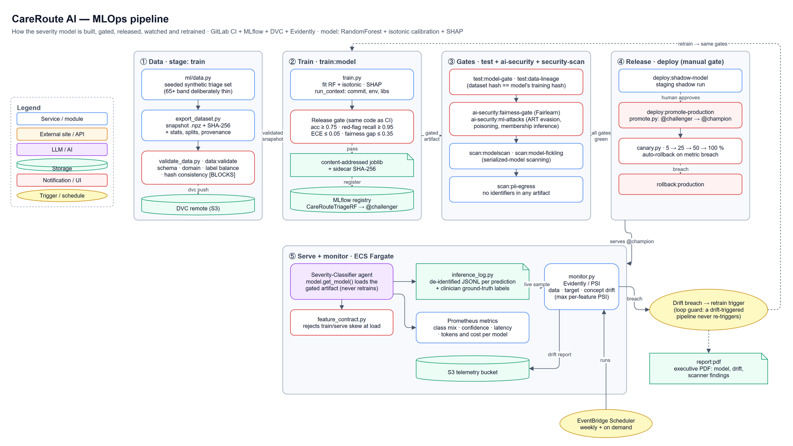

# CareRoute AI — the MLOps pipeline

**How a clinical triage model gets built, gated, released, watched and retrained, so that a model which fails a quality, safety or fairness bar cannot reach patients and nobody has to remember to check.**

I built this as the ML/MLOps owner of [CareRoute AI](https://github.com/gcjk768/careroute-ai), a multi-agent triage system made by a 5-person team for the NUS-ISS MTech (*Architecting AI Systems* practice module). It applies the MLOps toolchain taught in the NUS-ISS *Integrating & Deploying AI Solutions* course (MLflow, DVC, Evidently) to a real service. This repo pulls out my part so it can be read on its own: the ML package, its tests, the CI jobs and the design write-up. The full system (agents, frontend, Terraform) is in the [main repo](https://github.com/gcjk768/careroute-ai).



<sub>Editable source: [`docs/architecture.drawio`](docs/architecture.drawio)</sub>

## The problem

CareRoute's Severity-Classifier gives every patient an urgency level from P1 (resuscitation) to P5 (non-urgent). A model that quietly gets worse is dangerous in both directions: an under-triaged emergency waits at home, and an over-triaged cold takes an A&E slot. So the pipeline has three jobs:

1. **Never ship a bad model.** Every release has to clear hard thresholds, and the same gate code runs at training time and in CI.
2. **Know which model is serving and why.** Every artifact traces back to its data, code and environment.
3. **Notice when the world changes.** Drift in the inputs, the labels or the accuracy triggers a retrain, and the retrained model faces the same gates.

## The pipeline

A 10-stage GitLab pipeline runs on every push. The MLOps jobs are in [`ci/mlops-jobs.gitlab-ci.yml`](ci/mlops-jobs.gitlab-ci.yml), taken from the [full pipeline](https://github.com/gcjk768/careroute-ai/blob/main/app/.gitlab-ci.yml).

| Step | What happens | Code |
|---|---|---|
| 1 · Data | A seeded dataset is exported as a snapshot with a SHA-256 hash, statistics, splits and provenance, then versioned with DVC | [`export_dataset.py`](app/ml/export_dataset.py) |
| 2 · Validate | A blocking check of schema, value ranges, label balance and hash consistency before anything trains on the data | [`validate_data.py`](app/ml/validate_data.py) |
| 3 · Train | RandomForest + isotonic calibration + SHAP. Each run records the git commit, Python version and library versions as well as the data hash | [`train.py`](app/ml/train.py), [`run_context.py`](app/ml/run_context.py) |
| 4 · Gate | The release gate runs inside training, so a failing model is never saved or registered | [`train.py`](app/ml/train.py), [`model.py`](app/ml/model.py) |
| 5 · Register | A content-addressed joblib with a SHA-256 sidecar, registered in MLflow as `CareRouteTriageRF@challenger` | [`lifecycle.py`](app/ml/lifecycle.py) |
| 6 · Prove | CI re-checks the gate, proves the dataset hash equals the model's training hash, runs a Fairlearn fairness gate and ART adversarial tests, scans the serialized model, and checks no personal data leaks into artifacts | [`tests/`](tests/) |
| 7 · Release | Shadow deploy in staging, then a manual `@challenger → @champion` promotion and a 5 → 25 → 50 → 100 % canary that rolls back on a metric breach | [`promote.py`](app/ml/promote.py), [`canary.py`](app/ml/canary.py) |
| 8 · Serve | Serving only loads a gated artifact and never retrains. A feature contract rejects train/serve skew at load time | [`model.py`](app/ml/model.py), [`feature_contract.py`](app/ml/feature_contract.py) |
| 9 · Watch | Every prediction is logged without personal data, alongside clinician-confirmed labels. Evidently/PSI reports data, target and concept drift | [`inference_log.py`](app/ml/inference_log.py), [`monitor.py`](app/ml/monitor.py) |
| 10 · Retrain | A drift breach triggers a retrain through the same gates. A loop guard stops a drift-triggered run from triggering another | [`monitor.py`](app/ml/monitor.py) |

### What blocks a release

| Gate | Threshold |
|---|---|
| Model quality (`train:model` and `test:model-gate`) | accuracy ≥ 0.75, **red-flag recall ≥ 0.95**, calibration error (ECE) ≤ 0.05, fairness gap ≤ 0.35 |
| Data validation (`data:validate`) | schema, domain, label balance, hash consistency |
| Data lineage (`test:data-lineage`) | dataset hash **==** the model's training-data hash |
| Fairness (`ai-security:fairness-gate`) | subgroup accuracy parity within the same ceiling (Fairlearn) |
| Privacy (`scan:pii-egress`) | zero personal identifiers in any published artifact |

Red-flag recall is the one that matters most. Missing a P1/P2 case is far worse than any other mistake, so it gets its own floor, separate from overall accuracy.

### The drift → retrain loop


All three kinds of drift can trigger a retrain: data (the inputs shift), target (the label mix shifts) and concept (accuracy falls against clinician labels). Early on only data drift did, so a shifted label mix got through as long as the inputs looked familiar.

## The current model

| Metric | Value | Gate |
|---|---|---|
| Accuracy | 0.917 | ≥ 0.75 |
| Red-flag recall | 0.957 | ≥ 0.95 |
| Calibration error (ECE) | 0.022 | ≤ 0.05 |
| Fairness gap (worst vs best subgroup) | 0.549 → **0.170** after mitigation | ≤ 0.35 |
| Counterfactual sex-flip rate | 0.0 | ~0 |

The training data under-represents patients aged 65+ on purpose, as happens in real clinical data, so the fairness mitigation has something real to fix. The weakest subgroup is still 65+ female at 0.79.

## Two bugs I found in my own pipeline

**Drift detection could never fire.** PSI came out as exactly 0.0 for 27 of the 29 features. They are binary, so the quantile bin edges collapsed into a single bin, and the gate averaged across all features. Binary features are now binned properly, and the gate reads the *worst* per-feature PSI instead of the average.

**The model couldn't see minor injuries.** An evaluation found no features for minor trauma, so every cut and sprain got the same 0.448 confidence and was quietly escalated. This is now measured and reported as `zeroCoverageRate`. It is deliberately *not* a gate, because gating it would make the gap look intentional.

## What runs and what is only wired up

| Pillar | Status |
|---|---|
| Experiment tracking + model registry (MLflow) | **Runs** on every gated build |
| Data versioning + lineage (DVC + hash gate) | **Runs**; lineage is a blocking gate |
| Monitoring (Evidently/PSI, inference log, Prometheus) | **Runs** |
| Continuous training (weekly + drift trigger) | **Configured**; needs a pipeline trigger token to fire |
| Deployment lifecycle (shadow, promotion, canary, rollback) | **Configured**; defined and unit-tested, not yet run against a live environment |

Rows 4 and 5 are written and wired up, but haven't been proven in production. It's more useful to say so than to show five green ticks.

## Run it

```bash
pip install -r requirements.txt            # add -r requirements-mlops.txt for MLflow, DVC and Evidently
pytest                                     # the ML test suite
python -m app.ml.export_dataset            # snapshot + content hash
python -m app.ml.validate_data             # data-validation gate
python -m app.ml.train                     # train, gate, persist (and register if MLflow is installed)
python -m app.ml.monitor                   # drift + performance report
```

No API keys or cloud account are needed. The dataset is synthetic and seeded, so every run is reproducible.

## Repo layout

```
app/ml/        the ML package: data, features, model, training + release gate, registry lifecycle,
               promotion, canary, feature contract, inference log, drift monitor, fairness, report
app/redact.py  PII redaction used by the inference log
tests/         model gate, fairness, data provenance, canary, entrypoints, adversarial robustness
ci/            the MLOps jobs from the full GitLab pipeline (for reading)
docs/          architecture (draw.io), pipeline stages, drift → retrain loop
```

## Stack

Python · scikit-learn · SHAP · Fairlearn · Adversarial Robustness Toolbox · MLflow · DVC · Evidently · Prometheus · GitLab CI · AWS (ECS Fargate, S3, EventBridge Scheduler)

## What I'd do next

- Serve the model on Kubernetes (KServe) with the canary handled by the platform instead of application code.
- Fire the continuous-training trigger for real and run a full drift → retrain → promote cycle in staging.
- Replace the synthetic dataset with a de-identified clinical sample, with the lineage and PII gates already in place.

---

**James Koh** · [LinkedIn](https://www.linkedin.com/in/kohguanchinjames/) · [GitHub](https://github.com/gcjk768) · Full system: [careroute-ai](https://github.com/gcjk768/careroute-ai)

> Academic prototype. CareRoute AI is not a certified medical device and must not be used for real clinical decisions.
